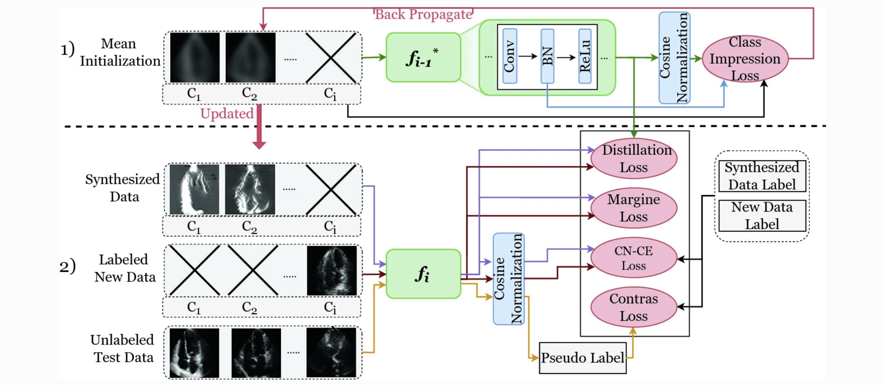

# Class-Impresion-for-Data-free-Incremental-Learning

This is the PyTorch implemention of our paper **"Class Impression for Data-Free Incremental
Learning"**(https://link.springer.com/chapter/10.1007/978-3-031-16440-8_31) accpeted by MICCAI 2022
by [Sana Ayromlou](https://github.com/sanaAyrml), Tresa Tsang, Prang Abolmaesumi
,and [Xiaoxiao Li](https://xxlya.github.io/xiaoxiao/)

## Abstract

> Our contributions are summarised as:
> - We propose **CI** to generate prototypical synthetic images with high quality for each class by 1) initializing
    the synthesis process with the mean image of each class, and 2) regularizing pixel-wise optimization loss of image
    synthesis using moments of normalization layers.
> - We introduce several novel losses to mitigate domain shift between synthesized images and original images, handle
    class imbalance issues and encourage robust decision boundaries for handling catastrophic forgetting.


Two main steps of **CI** contain: 1) Continual data synthesis: Initialize a batch of images with the
mean of each class to synthesize images using a frozen model trained on the previous task. Update the batch by
back-propagating and using the moments saved in the normalization layer as a regularization term; 2) Model update on new tasks: Leverages
information from the previous model using the distillation loss. Overcome data imbalance and prevent catastrophic
forgetting of past tasks with the cosine normalized cross-entropy (CN-CE) loss and margin loss. Mitigate domain shift
between synthesized and original data with a novel intra-domain conservative (IdC) loss, a semi-supervised domain
adaptation technique.

## Sections

The main folder contains the code implemented for the MedMNIST dataset. You can get access to MedMNIST dataset
via [Zendo](https://doi.org/10.5281/zenodo.6496656). You could also use our code to download automatically by
setting `download_data=True` in [config](configs) files.

### Dataloader
Contains dataloader implemented for each of datasets. You can add your own dataloader or adjust the implementation of other dataloaders. Make sure to import your dataloader in [main.py](main.py).
### Model
Contains modified Resnet model architecture used in CCSI. Folder [models/layers](models/layers) contains implementation of introduced two novel layers **"Cosine Linear and Continual Normalization"**.
### Wandb
We use Wandb sweep to plot our results and hyperparameter tuning. Replace project name and your wandb key in `wandb_acc` and `wandb_key` accordingly in [config](configs) files.
### Config
All hyperparamteres are set in [config](configs) as `.yaml` files for each dataset. Each task has a separate confid and hyperparameters which can be adjusted.
### Training Scheme
The class incremental training procedures, loss functions and ... are implemented in [incremental_train_and_eval.py](incremental_train_and_eval.py).
### Synthesis Scheme
The continual class specific impression synthesis and its loss functions are implemented in [continual_class_specific_impression.py](data_synthesis/continual_class_specific_impression.py).
## Install
### Requirements

Requirements can be installed using:
```
pip install -r requirements.txt
```
### Running the Code
In order to run the code you use configs provided for each task of each dataset. To run each config:

```
wandb sweep configs/[dataset_name]/sweep_task_[task_number].yaml
```
Your trained models will be saved in `../saved_models/[dataset_name]/[model_name]`. You need to put this address in `saved_model_address` in each config to keep training for following tasks use the same command as above.

## Acknowledgement

The code is includes borrowed implementations from (https://github.com/hshustc/CVPR19_Incremental_Learning)
and (https://github.com/NVlabs/DeepInversion). Thanks for their great works.

## Citing

@inproceedings{ayromlou2022class,
  title={Class Impression for Data-Free Incremental Learning},
  author={Ayromlou, Sana and Abolmaesumi, Purang and Tsang, Teresa and Li, Xiaoxiao},
  booktitle={International Conference on Medical Image Computing and Computer-Assisted Intervention},
  pages={320--329},
  year={2022},
  organization={Springer}
}

## Contact

For questions and suggestions, please contact Sana Ayromlou via ayromlous@gmail.com.
